# 动态网页课程设计 心理健康科普平台

## 目录

第1章  设计思路 

第2章  数据表 

2.1 数据结构与字段说明 

2.2 E-R图

第3章  功能设计 

3.1 核心功能 

3.2 流程图

第4章  实现的效果抓图 

4.1 index.html 

4.2 login.html

4.3 register.html

4.4 content.html

4.5 articles.html

第5章  设计小结

## 第1章 设计思路

**目标**：开发一个心理健康科普平台，旨在为用户提供心理健康相关文章的浏览、搜索和分类筛选功能，同时支持用户注册、登录和内容管理。平台采用前后端分离架构，前端使用 Bootstrap 5.3 和 JavaScript 实现交互，后端使用 PHP 和 MySQL 管理数据。

**用户需求：**浏览文章、搜索关键字、按分类筛选、注册/登录、管理员管理内容。

**功能模块：**文章展示、搜索与筛选、用户认证、内容管理。

技术选型： 

**前端：**Bootstrap 5.3（响应式布局）、JavaScript（动态交互）、Noto Sans SC 字体（中文优化）。

**后端：**PHP（处理请求）、MySQL（数据存储）。

**架构设计**： 

**前端：**index.html（主页）、login.html（登录）、register.html（注册）、ai_apps.html（内容管理）。

**后端：**articles.php（文章查询）、categories.php（分类查询）、login.php（登录验证）、register.php（用户注册）。

数据库：psych_db，包含 users、articles、categories 表。

 

## 第**2章** 数据表

#### 2.1 数据结构与字段说明

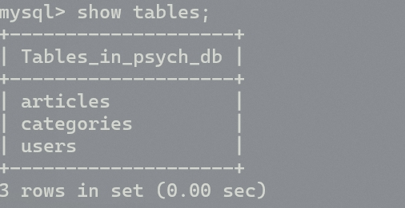 

***\*users\****:存储用户信息

表2-1 users表

| 列名     | 列名说明 | 数据类型 | 长度 | 主码或外码 |
| -------- | -------- | -------- | ---- | ---------- |
| id       | 用户ID   | INT      | 11   | 主码       |
| username | 用户名   | VARCHAR  | 50   |            |
| Email    | 邮箱     | VARCHAR  | 100  |            |
| Address  | 地址     | VARCHAR  | 255  |            |
| password | 密码     | VARCHAR  | 255  |            |

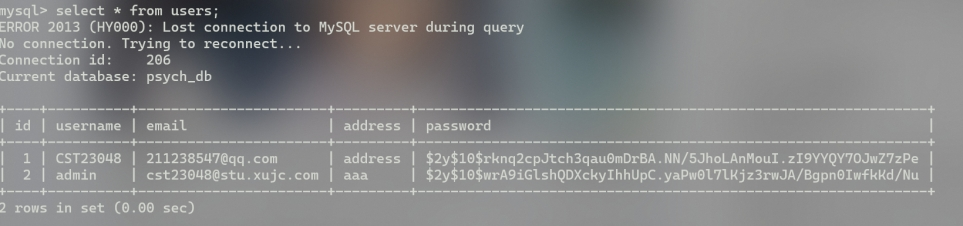 

***\*categories\*******\*:\****存储文章分类

表2-2 categories表

| 列名 | 列名说明 | 数据类型 | 长度 | 主码或外码 |
| ---- | -------- | -------- | ---- | ---------- |
| id   | 分类ID   | INT      | 11   | 主码       |
| name | 分类名称 | VARCHAR  | 50   |            |

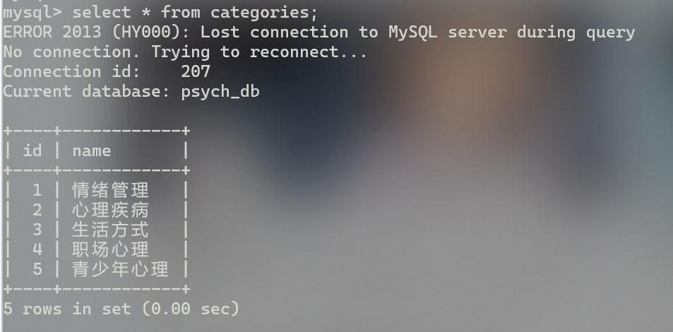 

***\*articles:\****存储文章信息

表2-3 articles表

| 列名        | 列名说明   | 数据类型 | 长度 | 主码或外码 |
| ----------- | ---------- | -------- | ---- | ---------- |
| id          | 文章ID     | INT      | 11   | 主码       |
| title       | 分类名称   | VARCHAR  | 255  |            |
| thumbnail   | 缩略图路径 | VARCHAR  | 255  |            |
| Summary     | 文章摘要   | TEXT     |      |            |
| content     | 文章内容   | TEXT     |      |            |
| source      | 来源       | VARCHAR  | 100  |            |
| date        | 发布日期   | DATE     |      |            |
| Category_id | 分类ID     | INT      | 11   | 外码       |

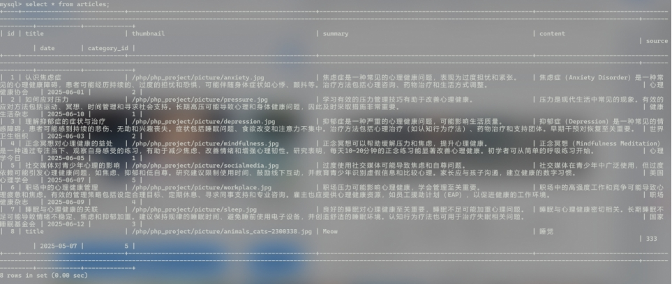 

#### 2.2 E-R图

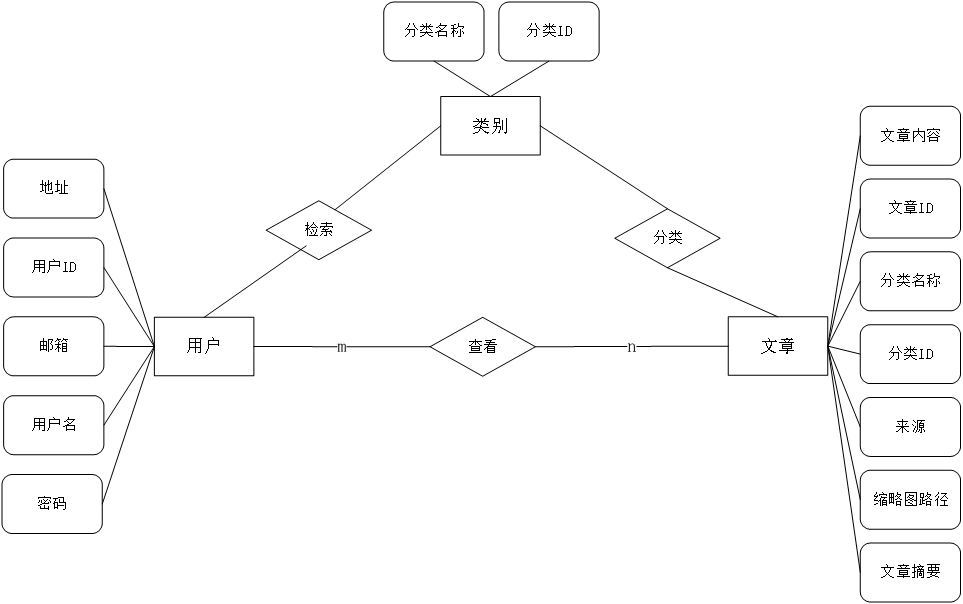

 

## 第**3章** 功能设计

#### 3.1 核心功能

**用户认证：** 

注册：用户输入用户名、邮箱、密码，提交到 register.php，存储加密密码。

登录：验证用户名和密码，跳转到 content.html（内容管理）。

**文章浏览：** 

主页（index.html）展示文章卡片，包含标题、缩略图、摘要、分类等。

**搜索与筛选：** 

搜索：输入关键字，查询标题匹配的文章。

分类筛选：选择分类（如“心理健康”），显示对应文章。

**内容管理：** 

管理员在 content.html 添加、编辑、删除文章（需登录）。

#### 3.2 流程图

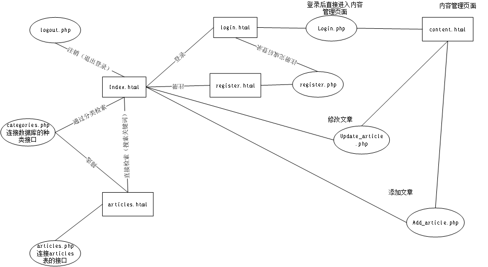

## 第**4章** 实现的效果抓图

#### 4.1 index.html

 

搜索功能：

 

分类词条筛选功能：

 

登录后右上角显示用户名及“欢迎”:

 

#### 4.2 login.html

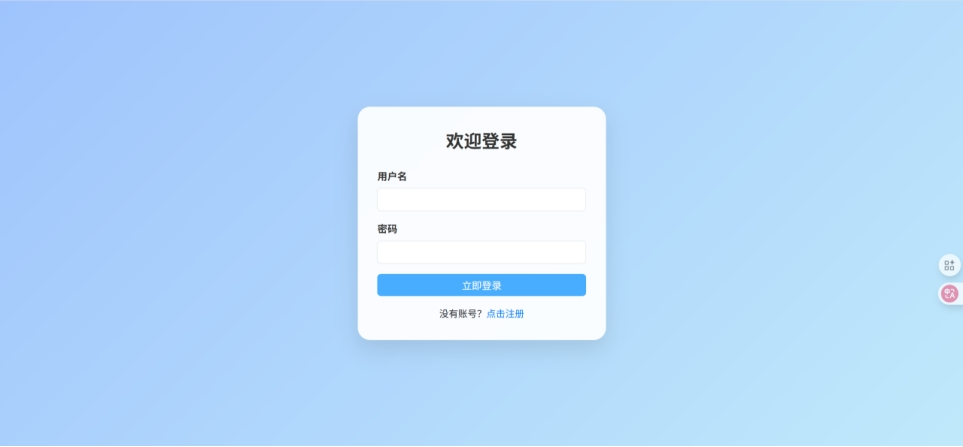 

登录成功提示：

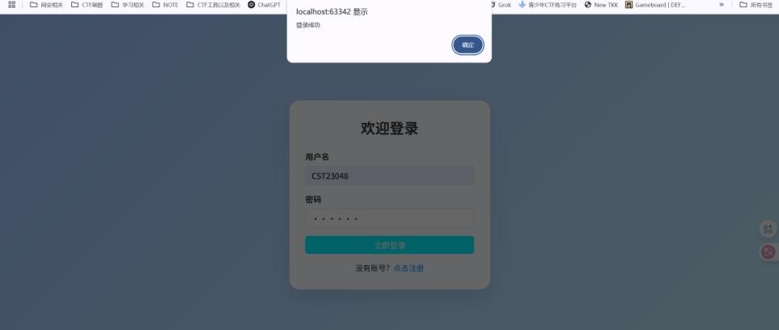 

#### 4.3 register.html

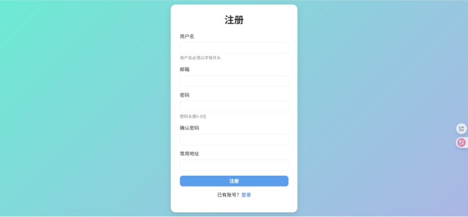 

#### 4.4 content.html

登录后直接跳转此页面：

 

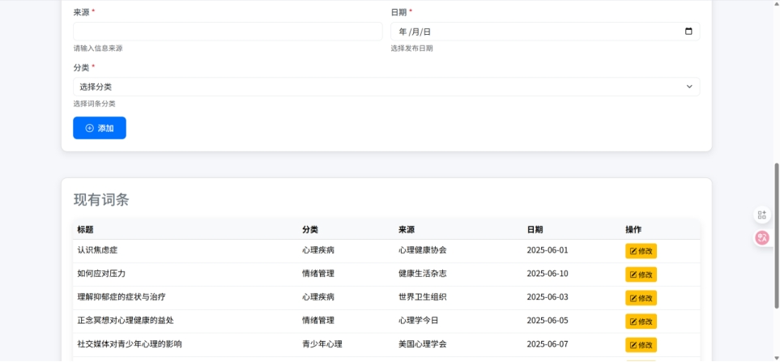 

这里有一个修改的功能：

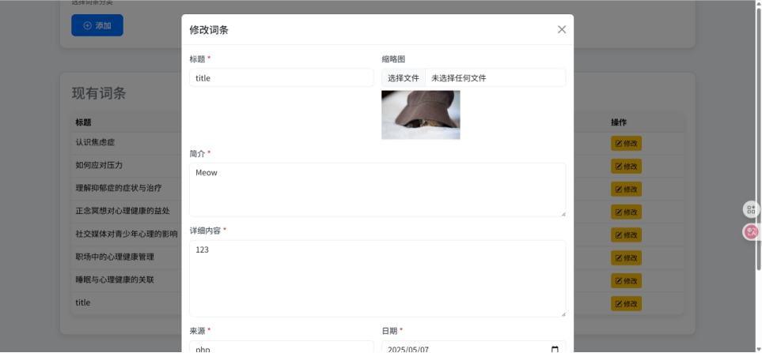 

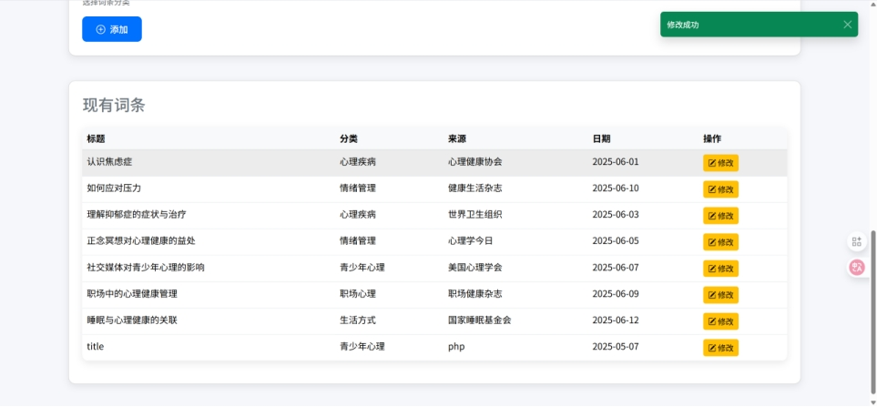 

#### 4.5 articles.html

 

## 第**5章** 设计小结

一开始连接数据库那块，由于电脑里除了phpstudy的mysql外，还安装了数据库课需要的版本，产生了端口冲突，于是保留了navicat里3306端口，phpstudy里用3307端口，数据库连接方式直接用powershell管理了，感觉比图形化方便点。

搜索功能，以及分类筛选需前后端协作，调试 SQL 查询和参数传递较为复杂。

代码中实现了基本的错误处理，例如：

if ($conn->connect_error) {

  die(json_encode(['error' => '数据库连接失败: ' . $conn->connect_error]));

}//数据库连接失败的时候返回json错误。

 

此外，在处理词条详情页的时候出现过无法连接到数据库的问题，缩略图及内容都无法显示。后来查找问题发现article.html 调用 articles.php?id=1 时无内容显示，因为 articles.php 仅支持列表查询，未处理 id 参数。缺少针对单篇文章的 SQL 查询逻辑。所以，解决方案如下：

在 articles.php 中添加 id 参数处理，返回单个文章对象：

if ($article_id) {

  $sql = "SELECT a.id, a.title, ... FROM articles a LEFT JOIN categories c ON a.category_id = c.id WHERE a.id = ?";

  // ...

  echo json_encode($article);

}
